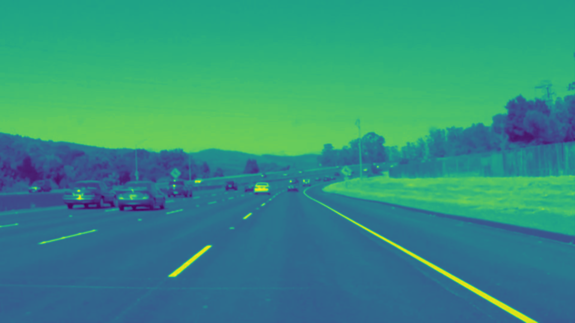
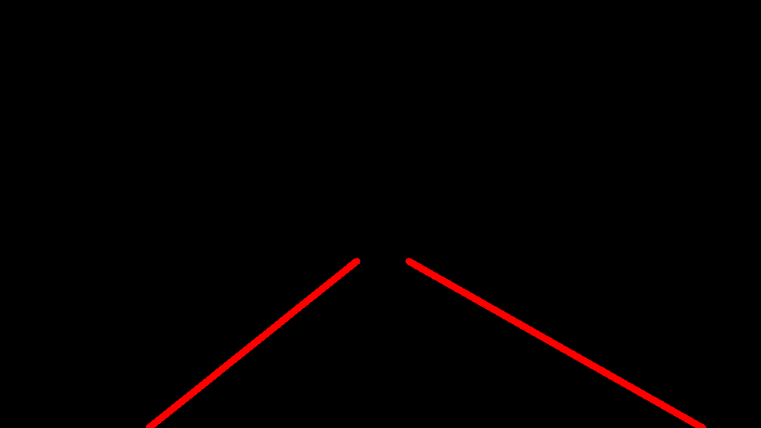
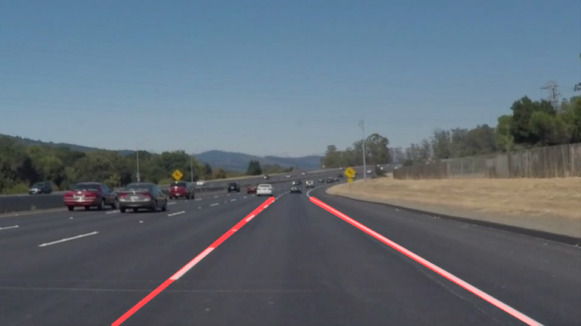
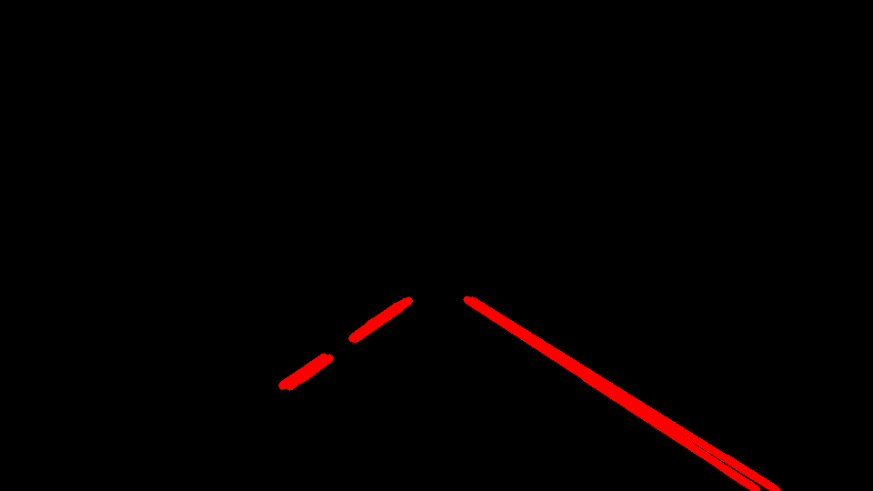
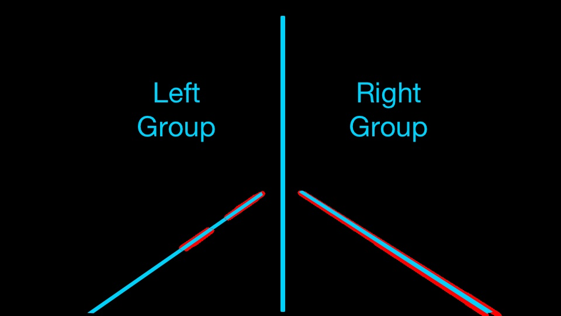
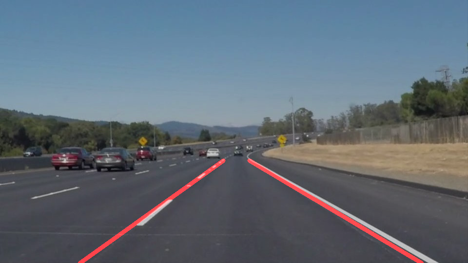

**Finding Lane Lines on the Road**

The goals / steps of this project are the following:
* Make a pipeline that finds lane lines on the road
* Reflect on your work in a written report
---

### Reflection

My pipeline consisted of 6 steps. First, I ignored all but one of the color channels which essentially converted the images to grayscale, and I applied a gaussian blur for additional smoothing.

The smoothing helped reduce the number of lines picked up by the next step: using the Canny algorithm. I used the `canny()` function to identify the edges in the grayscaled image. In attempting to keep the low:high ratio to about 1:3 per recommendation, as the image was grayscale, I kept my high below 255.  Truthfully, though, I just kept tweaking the inputs to the `canny()` function until my output was mainly occupied by the lane lines. Third, I limited the region of interest to the area immediately surrounding the current lane up to the nearest car in an attempt to remove competing lanes and edges in the image. Fourth, I applied the opencv's `HoughLinesP` function that identifies lines in the image according to my criteria.  Admittedly, I didn't play much with either rho or theta and found the majority of success in better identifying lines depending on `min_line_len`, `max_line_gap`, and `threshold`.  My main purpose was to ignore as much noise as possible while still detecting dashed lanes.  Fifth, I took the lines obtained from Hough space and averaged them to two lane lines on opposing edges of my lane. I'll go into more depth in the following paragrah.  My final, and sixth, step was overlaying the averaged hough lines onto the original image. 

In order to draw a single line on the left and right lanes, I modified the draw_lines() function by averaging the resulting Hough lines in one frame and then averaging the lines again among a limited set of frames.  The idea behind these two steps was based on the assumption that different frames in a short time period could work together to better identify the current average lane lines. 
 In order to average the lines of each frame I first grouped lines based on slope. The hope was that lines on competing sides of the image would have opposing slopes.  Once grouped, lines' intercept and slope were averaged into one collective intercept and slope.  These two groups, positive and negative, could then become two lines that represented the lane lines in a frame.  In order to average lines over a set of frames, the resulting lines for each group would be stored in a corresponding buffer accessible via a global variable.  This FIFO buffer would gradually "forget" about a frame's line as it lost relevance and was bumped out of the buffer by a more recent line.  Lines in one of the buffers would represent the collective output for one of the lines in a frame.  Since the lines were really a collection of points another line would be constructed that fit amongst them, a best fit line.

#### Shortcomings

One potential shortcoming would be what would happen when a car comes close to vehicle.  Lines detected on the vehicle would greatly affect the output of both the left and right lane. This is already visible in the last "challenge" video where lines on the hood are throwing off the pipeline. 

Another potentional shortcoming, were if a line were not detected or if a exiting road suddenly appeared.  The buffer would assume we just had problems detecting a line and assume a line based on the past frames.  Even if I were to update the buffer such that reacted appropriately it still slightly affects "reaction time".  

Another short coming could occur if any markings or lane paintings (eg HOV) appeared inside the lane.  Really any significant visual abberation in the lane that should be driven over would affect what the car would consider its lane.  

There are obviously more problems with the pipeline than I've mentioned.

#### Possible Improvements

One possible improvement would be to limit (based on the vehicle) what the viewport is to avoid picking up noise from the car's hood. 

Another potential improvement could be to ignore lines whose slope displayed a much to abrupt change with regard to the previous slopes.  

Yet another potential improvement might be clearing the buffer every set period of time and especially introducing gradual clearing as no frames were detected.  In this way we may improve reaction time.